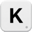
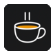

# Lanrenwen Studio 🚀

---

### 🚀 Apps

<table align="center" width="100%">
  <tr>
    <td align="center" width="20%" valign="top">
      <a href="https://lanrenwenstudio.github.io/keylaunch-site/">
          
        <code>KeyLaunch (键启)</code>
      </a>
        
      
        Shortcut & App Launcher 
        快捷启动与调度
      
    </td>
    <td align="center" width="20%" valign="top">
      <a href="https://lanrenwenstudio.github.io/pauseloop-site/">
          
        <code>PauseLoop</code>
      </a>
        
      
        Focus & Break Timer 
        专注与打卡提醒
      
    </td>
    <td align="center" width="20%" valign="top">
      <a href="https://englishcc.com">
          
        <code>English CC</code>
      </a>
        
      
        Dual Subtitles & Dictionary 
        双语字幕与悬浮查词
      
    </td>
    <td align="center" width="20%" valign="top">
      <a href="https://lanrenwenstudio.github.io/side-stash/">
          
        <code>Side Stash</code>
      </a>
        
      
        Side Panel Snippet Manager 
        侧边栏片段暂存
      
    </td>
    <td align="center" width="20%" valign="top">
      <a href="https://lanrenwenstudio.github.io/highlight-share-site/">
          
        <code>Highlight Share</code>
      </a>
        
      
        Highlight & Card Exporter 
        划词高亮生成分享
      
    </td>
  </tr>
</table>

---

### 🛠️ Tech Stack & Tools

  
  
  
  
  

